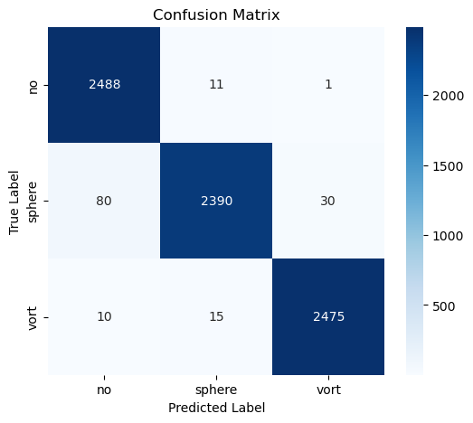
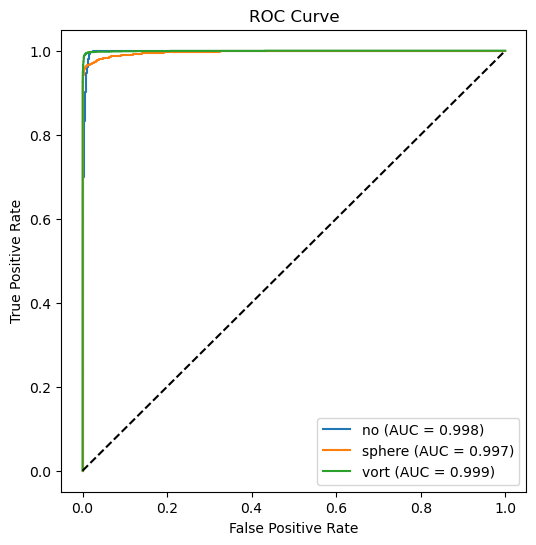

# Multi-Class Gravitational Lens Substructure Classification

## 1. Overview

In this project, we developed a deep learning model using PyTorch to classify gravitational lensing images based on the type of substructure they exhibit. The task was to distinguish between three categories:

- **No Substructure (`no`)**: Images showing strong lensing without noticeable substructure.
- **Sphere Substructure (`sphere`)**: Images with spherical substructures, analogous to cold dark matter subhalos.
- **Vortex Substructure (`vort`)**: Images exhibiting vortex-like patterns, potentially linked to alternative dark matter physics (e.g., axion or superfluid models).

The primary objective was to build a **highly accurate and robust classifier** capable of distinguishing subtle physical features across these categories.

---

## 2. The Dataset

- Validation dataset: **~7500 samples**
- Train dataset size: **~30000 images**
- Images represent simulated gravitational lensing systems with different substructure morphologies
- Data split into **training, and validation sets**
- Labels correspond to physical substructure classes (`no`, `sphere`, `vort`)

---

## 3. Our Approach

### Model Selection:
We use **EfficientNet-B1** (via `timm`) for **multi-class image classification**. The model is initialized with pretrained ImageNet weights and modified to output **three classes** corresponding to different substructure types (`no`, `sphere`, `vort`). EfficientNet is chosen for its strong performance and efficiency on image-based tasks.

---

### Data Preprocessing and Augmentation:
The input data consists of **3-channel astronomical images (64×64)**.

- Images are resized to **224×224** to match EfficientNet input requirements  
- A **log transformation followed by z-score normalization** is applied to standardize pixel values  

**Training augmentations:**
- Random rotations  
- Horizontal flips  
- Vertical flips  

**Validation/Test preprocessing:**
- Only resizing and normalization (no augmentation)  

These steps improve generalization and stabilize training.

---

### Training Strategy:

- **Loss:**  
  Cross-Entropy Loss (`CrossEntropyLoss`) is used for multi-class classification.

- **Optimizer:**  
  `AdamW` optimizer with a low learning rate ensures stable convergence and better generalization.

- **Learning Rate Scheduler:**  
  Cosine Annealing LR scheduler is used to gradually reduce the learning rate over epochs.

- **Multi-epoch training:**  
  The model is trained for **40 epochs** using mini-batch gradient descent, allowing it to learn complex hierarchical features.

- **Best model saving:**  
  The trained model weights are saved after training as:

  test_I_trained_wts_best_40ep.pth

---

### Inference Strategy:
During inference, the model outputs class probabilities using **softmax**, and final predictions are obtained via **argmax** over the three classes.

To improve robustness, **Test-Time Augmentation (TTA)** is applied:
- Rotations (0°, 90°, 180°, 270°)  
- Horizontal flips  

Predictions from augmented versions are averaged to produce final outputs.

---

This approach enables robust multi-class classification of gravitational lens substructures using deep convolutional networks and data augmentation techniques.

---

## 4. Evaluation Metrics

- Accuracy
- Precision, Recall, F1-score
- Confusion Matrix
- ROC Curve and AUC (One-vs-Rest)

---

## 5. Results

### Overall Performance
- **AUC:** 99.784%
- **Test Accuracy:** ~98.04%
- **Macro F1-score:** 0.98
- **Weighted F1-score:** 0.98

### Class-wise Performance

| Class    | Precision| Recall | F1-score | Support |
|----------|----------|--------|----------|---------|
| no       | 0.97     | 1.00   | 0.98     | 2500    |
| sphere   | 0.99     | 0.96   | 0.97     | 2500    |
| vort     | 0.99     | 0.99   | 0.99     | 2500    |
|accuracy  |          |        |   0.98   | 7500    |
|macro avg | 0.98     | 0.98   |   0.98   | 7500    |
|wtd avg   | 0.98     | 0.98   |   0.98   | 7500    |

---

## Model Weights

- Saved trained model weights after training
- Uploaded in the github as 

---

## Visualizations

### Confusion Matrix

### ROC Curve

### ROC-AUC Scores
- **total:** 99.784%
- **no:** 99.8%
- **sphere:** 99.7%  
- **vort:** 99.9%  

These confirm excellent separability and strong model confidence.

---

## 7. Dependencies

- Python >= 3.8  
- PyTorch  
- Torchvision  
- NumPy  
- Matplotlib  
- Scikit-learn  

---

## Author

**Milind Sarkar**  
IISER Mohali  