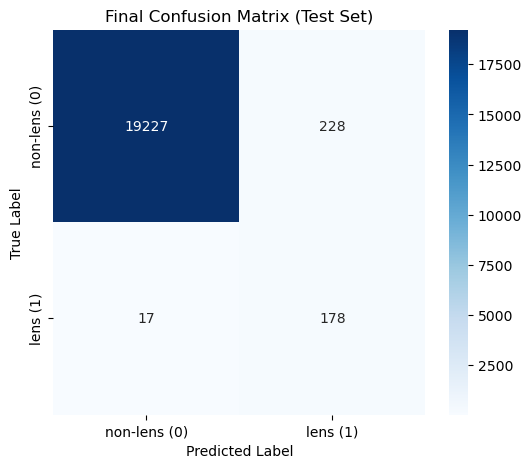
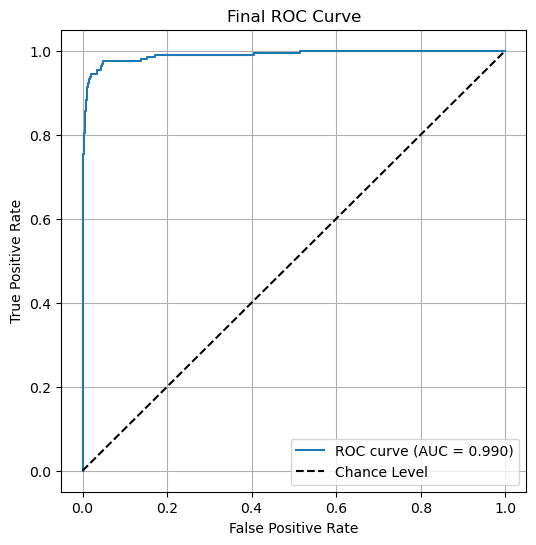

# Binary Gravitational Lens Substructure Classification

## 1. Overview

In this task, our goal was to build a binary classifier that can distinguish between images containing strong gravitational lenses and those without. Given the inherent class imbalance (with non-lens images vastly outnumbering lens images), we designed our approach to pay extra attention to the rare lens class while still maintaining overall high performance.

## 2. Dataset

- **Source:** The dataset is provided as `.npy` files.
- **Image Format:** Each image is represented as a 3-channel array with dimensions `(3, 64, 64)`, corresponding to different observational filters.
- **Directory Structure:**
  - Training:
    - `train_lenses/`: Images of lensed objects.
    - `train_nonlenses/`: Images of non-lensed objects.
  - Testing:
    - `test_lenses/`: Images of lensed objects.
    - `test_nonlenses/`: Images of non-lensed objects.
- **Class Imbalance:**  
  - **Train:** Approximately 1 lens for every 16 non-lens images.
  - **Test:** Approximately 1 lens for every 100 non-lens images.

---

## 3. Our Approach

### Model Selection:
We use **EfficientNet-B1** (via `timm`) for binary image classification. The model is initialized with **ImageNet pretrained weights** and modified to output a single logit (`num_classes=1`) for binary classification. EfficientNet is chosen for its strong performance and parameter efficiency, making it suitable for large-scale astronomical image data.

---

### Data Preprocessing and Augmentation:
The input data consists of **3-channel numpy arrays (64×64)** representing multi-band astronomical images.

- Each sample is converted to a tensor using a custom `ToTensor` transform  
- Images are **resized to 224×224** to match EfficientNet input requirements  

**Training augmentations:**
- Random rotations (0–360°)  
- Random horizontal flips  
- Random vertical flips  

**Validation/Test preprocessing:**
- Only resizing (no augmentation)  

Additionally, exploratory analysis was performed to estimate dataset **mean and standard deviation**, though normalization was not explicitly applied in the final pipeline.

---

### Training Strategy:

- **Loss:**  
  Binary Cross-Entropy with Logits Loss (`BCEWithLogitsLoss`) is used for stable binary classification.

- **Optimizer:**  
  `AdamW` optimizer with a learning rate of **5e-5** is used for better generalization and weight decay handling.

- **Learning Rate Scheduler:**  
  Cosine Annealing LR scheduler (`CosineAnnealingLR`) is applied with `T_max=40` to gradually reduce the learning rate.

- **Class Imbalance:**  
  Severe class imbalance (few lenses vs many non-lenses) is handled using **`pos_weight`** in the loss function:
  
  pos_weight = N_non-lens / N_lens

  This penalizes misclassification of the minority (lens) class more heavily.

- **Multi-epoch training:**  
  The model is trained for **40 epochs** using mini-batch gradient descent (batch size = 64). Training loss is tracked across epochs.

- **Best model saving:**  
  The trained model weights are saved after training:
  
  test_V_trained_wts_best.pth
  
  (Note: saving is done after training; no early stopping or checkpoint-based selection is used.)

---

### Inference Strategy (Test-Time Augmentation):

To improve robustness, **Test-Time Augmentation (TTA)** is applied:

- Rotations (0°, 90°, 180°, 270°)
- Horizontal flips

Predictions from multiple augmented versions are averaged to produce final probabilities.

---

This pipeline ensures robust performance under strong class imbalance and improves generalization using augmentation and TTA.

---

## 4. Evaluation Metrics

- Accuracy
- Precision, Recall, F1-score
- Loss Curve
- Confusion Matrix
- ROC Curve and AUC (One-vs-Rest)

---

## 5. Results

### Overall Performance
- **AUC:** 99.0%
- **Test Accuracy:** ~98.8%

### Class-wise Performance

| Class      | Precision| Recall | F1-score | Support |
|----------  |----------|--------|----------|---------|
|non-lens(0) | 1.00     | 0.99   |   0.99   | 19455   |
|lens(1)     | 0.44     | 0.91   |   0.59   | 195     |
|            |          |        |          |         |
|accuracy    |          |        |   0.99   | 19650   |
|macro avg   | 0.72     | 0.95   |   0.79   | 19650   |
|wtd avg     | 0.99     | 0.99   |   0.99   | 19650   |

---

## Model Weights

- Saved trained model weights after training
- Uploaded in the github as 

---

## Visualizations

### Loss Curve
[Loss curve](Test_V_train_loss.png)

### Confusion Matrix

### ROC Curve

### ROC-AUC Scores
- **total:** 99.0%
 

These confirm excellent separability and strong model confidence.

---

## 7. Dependencies

- Python >= 3.8  
- PyTorch  
- Torchvision  
- NumPy  
- Matplotlib  
- Scikit-learn  

---

## Author

**Milind Sarkar**  
IISER Mohali  